# MCP Server Proxy

Exposez un serveur MCP distant sous forme de proxy sécurisé avec Amplify Fusion de la solution Axway AI Gateway, puis testez-le dans Claude Desktop.

## Prérequis

* Accès à Amplify Fusion: [https://fr-techlab.sandbox.fusion.services.axway.com](https://fr-techlab.sandbox.fusion.services.axway.com)
  
* URL d'un serveur MCP distant à proxyfier ([https://mcpdemo.tools](https://mcpdemo.tools) fournit un serveur MCP en ligne gratuit, pratique pour les tests)
* [Claude Desktop](https://claude.com/download) installé, avec un compte Claude gratuit ou supérieur
* [Node.js](https://nodejs.org/fr) installé sur le même poste

## Étapes

### 1. Créer un proxy MCP

* Ouvrez votre projet Amplify Fusion dans le module **Designer**

* Ajoutez un nouveau serveur MCP
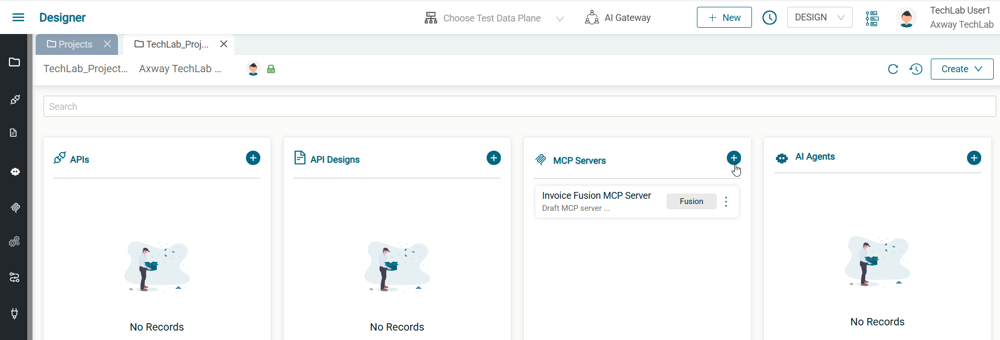
  * Méthode de création : **External MCP Server**
  * Nom du serveur : `Order Proxy MCP Server`
  * Fusion MCP Connection : choisissez **Create new connection**
  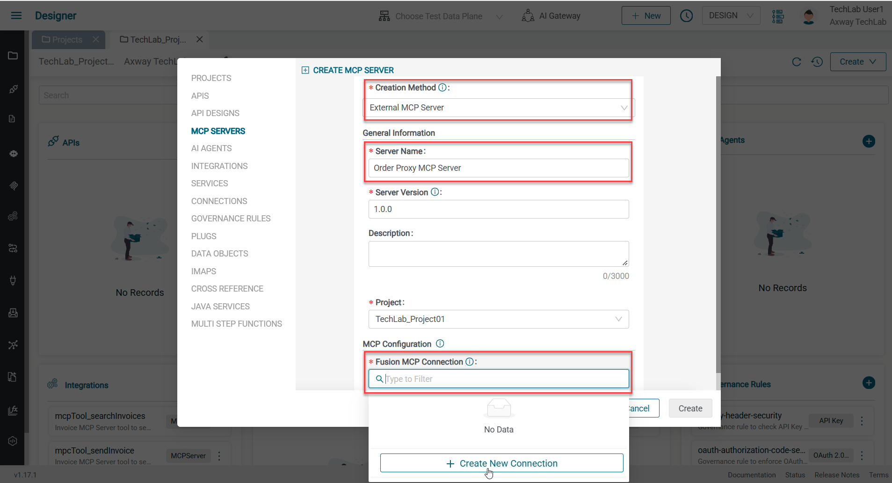
    * Nom de l'artefact : `Order Remote MCP Server`
    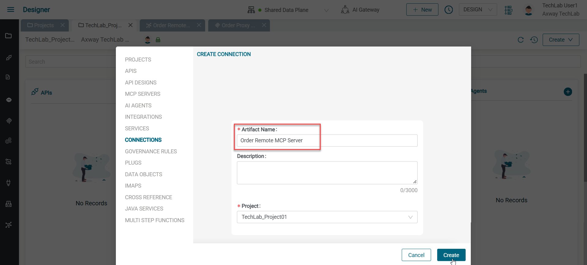
    * Service Root URL : `https://mcpdemo.tools/mcp`
    * Cliquez sur **Update** pour enregistrer la connexion
  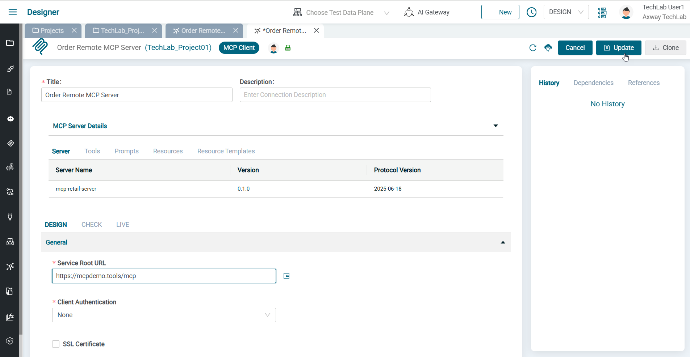
  * Cliquez sur **Resume MCP Proxy Creation** pour revenir au formulaire de création du serveur MCP
  * Vérifiez que **Order Remote MCP Server** est bien sélectionné dans le champ **Fusion MCP Connection**
  * Cliquez sur **Create**
  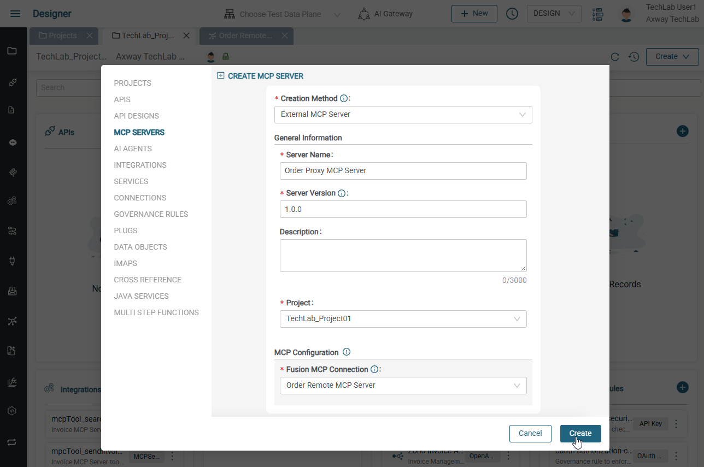
* Vérifiez la configuration MCP et les tools
* Ajoutez un chemin d'accès (base path) unique (utilisez par exemple votre nom d'utilisateur)
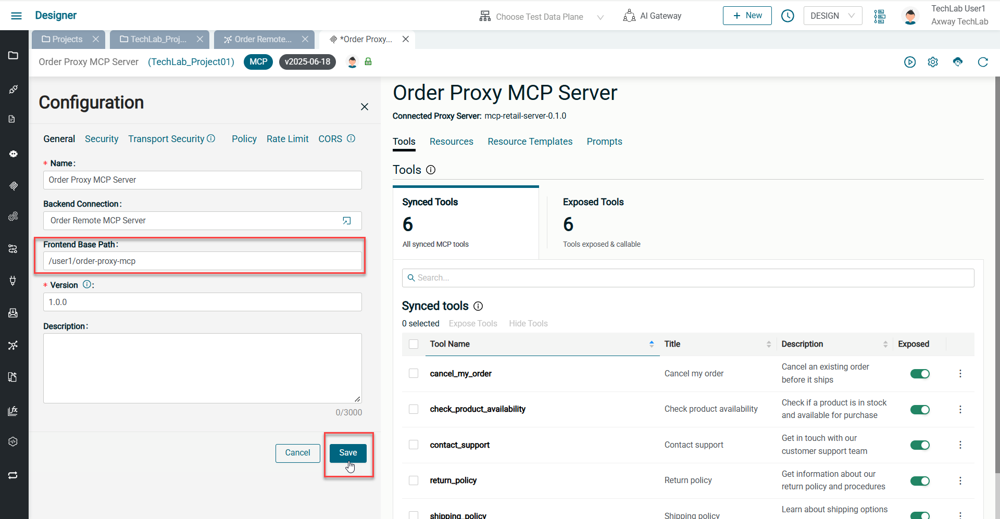
* Cliquez sur **Save**

### 2. Activer le proxy MCP

* Activez le serveur MCP sur le data plane Fusion avec le bouton 
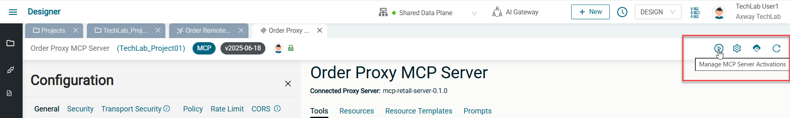
* Copiez l'URL du proxy MCP
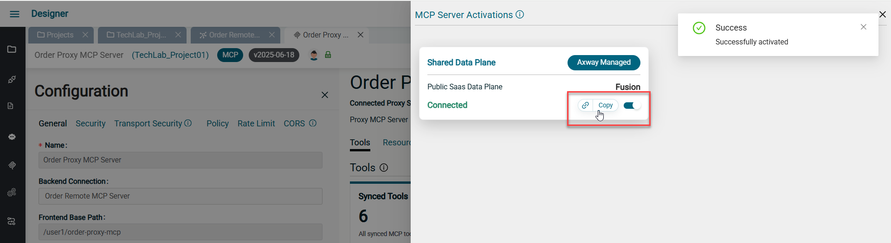

### 3. Tester depuis Claude Desktop

* Ouvrez la configuration de Claude Desktop (File > Settings > Developers > Edit Config)
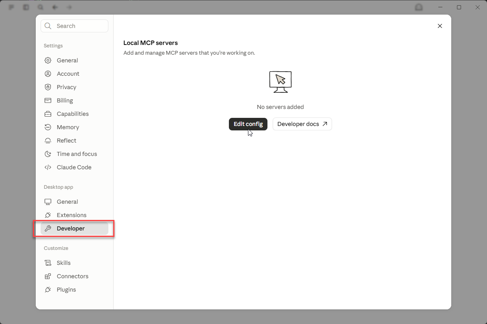
* Ajoutez votre proxy MCP dans **claude_desktop_config.json** :
  ```json
  {
    "mcpServers": {
      "Order Proxy MCP Server": {
        "command": "npx",
        "args": ["mcp-remote", "<votre URL de proxy MCP>"]
      }
    },
    "preferences": { ... }
  }
  ```
* Enregistrez le fichier de configuration
* Redémarrez Claude Desktop (File > Exit, puis rouvrez l'application)
* Vérifiez que le statut du serveur MCP est **running**
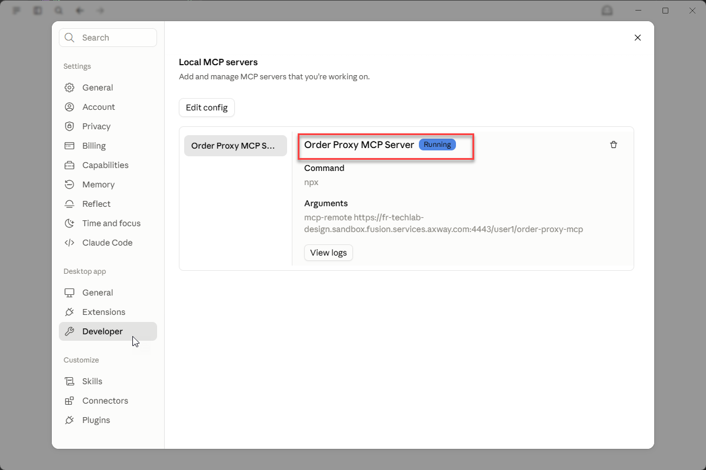
* Démarrez une nouvelle conversation, activez le proxy MCP, et envoyez des prompts de test :
  * `Où en est la commande 123?` -> doit fournir le statut de la commande
  * `Annule la.` -> doit annuler la commande


### 4. (Optionnel) Choisir les tools du serveur MCP à proxyfier

* Désactivez le serveur MCP
* Décochez les tools **cancel_my_order** et **check_product_availability**
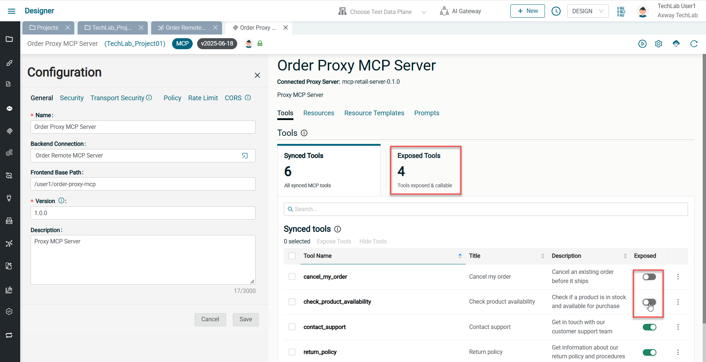
* Réactivez le serveur MCP
* Recharger Claude Desktop (View > Reload)
* Démarrez une nouvelle conversation, activez le proxy MCP, et envoyez des prompts de test :
  * `Où en est la commande 456?` -> doit fournir le statut de la commande
  * `Annule la.` -> ne doit pas fonctionner, puisque le tool n'est plus exposé


### 5. (Optionnel) Ajouter la sécurité


* Désactivez le serveur MCP
* Changer la version à `2.0.0`
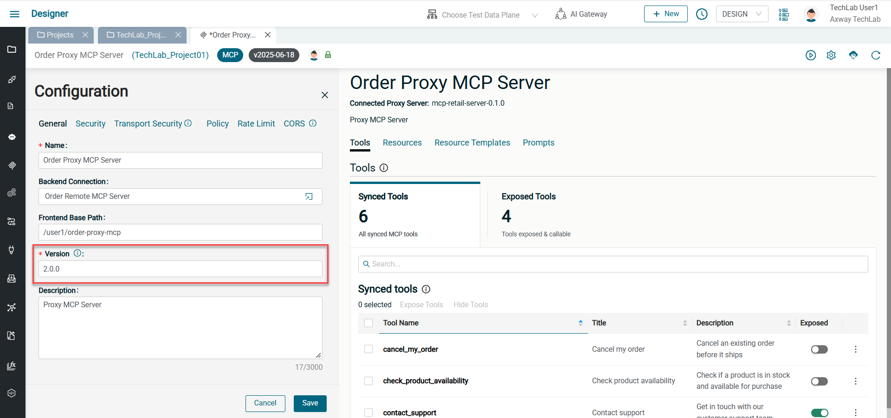
* Ouvrez l'onglet **Security**
* Choisissez **API key** ou **OAuth 2.0 (JWT Validation)** pour l'inbound security 
* Sélectionnez la governance rule correspondante
* Cliquez sur **Save**
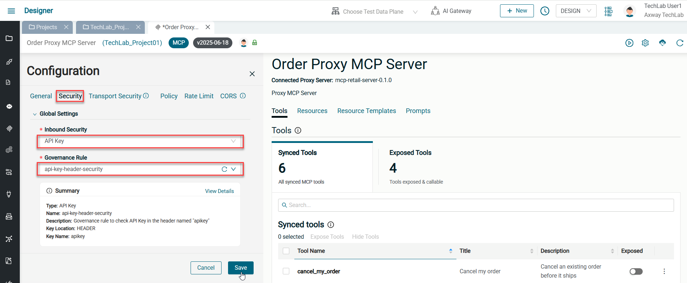
* Réactivez le serveur MCP
* Ouvrez le menu **Applications** dans le module **Manager**
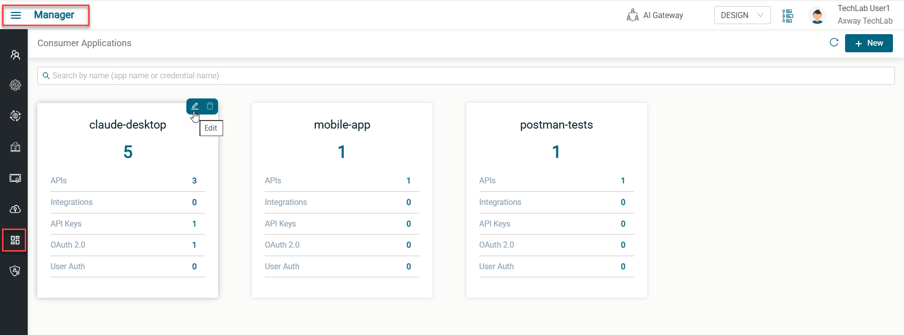
* Modifier l'application client **claude-desktop**
* Dans l'onglet MCP Server, ajoutez votre Proxy MCP Server
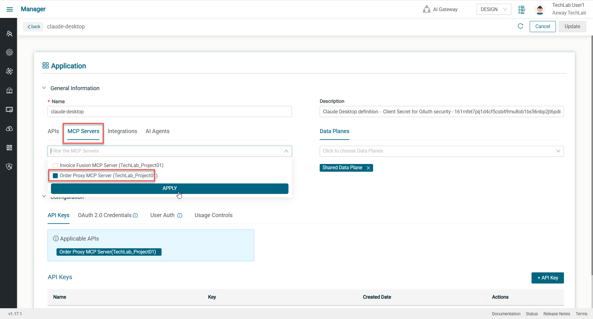
* Si vous avez choisi la sécurité **API Key**, copiez la clé existante dans l'onglet **API Key**.
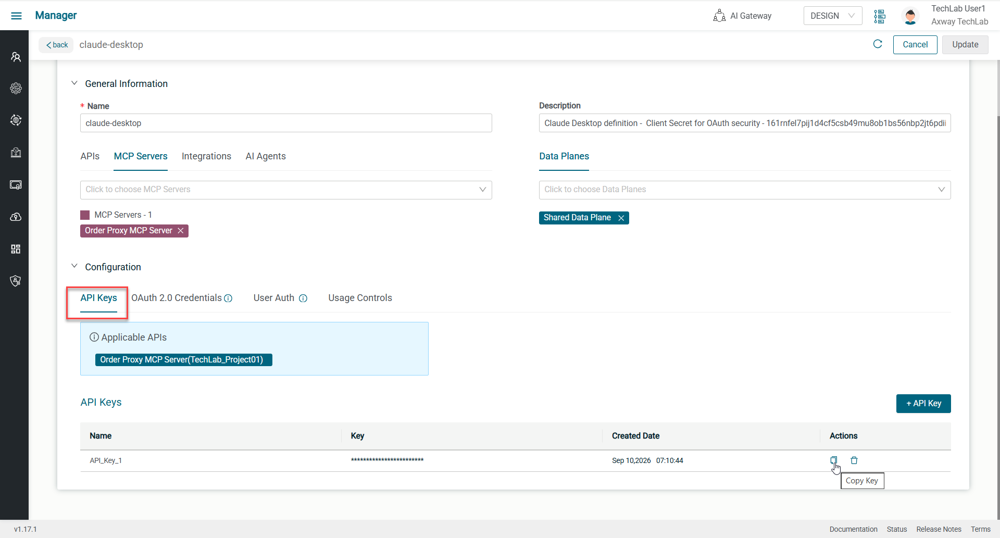
* Si vous avez choisi la sécurité **OAuth**, copiez le **client ID** déclaré dans **OAuth 2.0 Credentials** et le **client secret** temporairement indiqué dans la description (le secret n'est normalement visible que côté Identity Provider)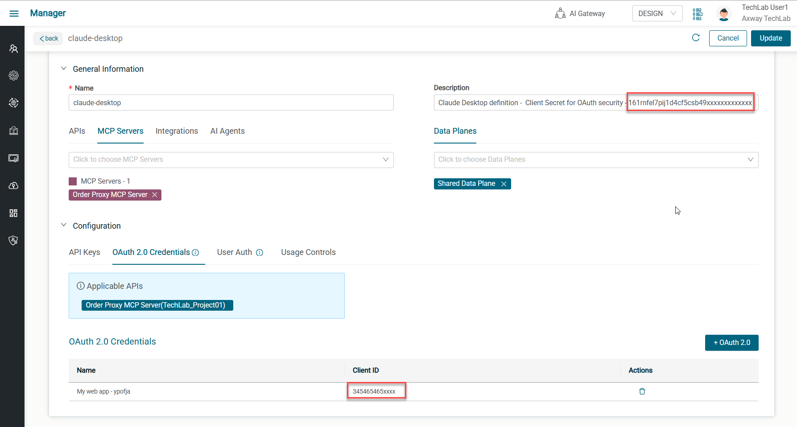
* Mettez à jour la configuration Claude Desktop en conséquence :

  Si vous utilisez une API key, ajoutez-la en tant qu'en-tête :
  ```json
  {
    "mcpServers": {
      "Order Proxy MCP Server": {
        "command": "npx",
        "args": [ "mcp-remote", "<votre URL de proxy MCP>", "--header", "apikey:<votre api key>" ]
      }
    },
    "preferences": { ... }
  }
  ```

  Si vous utilisez OAuth 2, passez à `mcp-remote-static` et ajoutez les informations client fournies :
  ```json
  {
    "mcpServers": {
      "Order Proxy MCP Server": {
          "command": "C:\\PROGRA~1\\nodejs\\npx.cmd",
          "args": [ "mcp-remote-static", "<votre URL de proxy MCP>", "--static-oauth-client-info", "{\"client_id\":\"<votre client id>\",\"client_secret\":\"<votre client secret>\"}" ]
        }
    },
    "preferences": { ... }
  }
  ```
* Enregistrez le fichier de configuration
* Redémarrez Claude Desktop (File > Exit, puis rouvrez l'application).
* Vérifiez que le statut du serveur MCP est **running** 
  > Une connexion avec des identifiants utilisateurs peut être nécessaire en cas d'OAuth - utilisez les mêmes credentials que pour Fusion)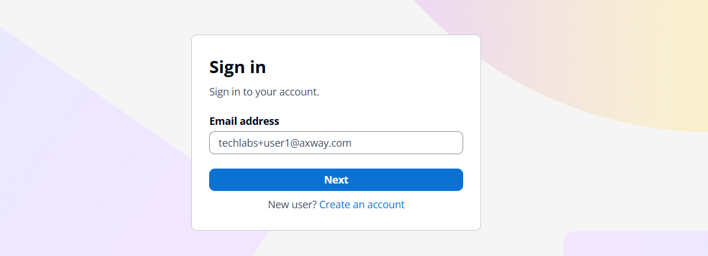
