# Serveur MCP Fusion

Créez un serveur MCP avec un tool personnalisé reposant sur une connexion OpenAPI dans Amplify Fusion / AI Gateway, puis testez-le dans Claude Desktop.

## Prérequis

* Accès à Amplify Fusion (https://fr-techlab.sandbox.fusion.services.axway.com) et à un projet avec un Server MCP en cours de création
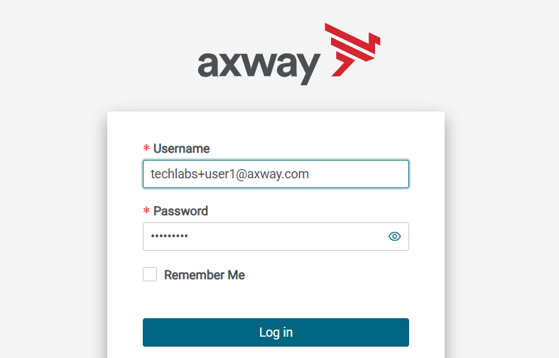
* Détails de connexion à une Open API de gestions de factures
* Claude Desktop installé (nécessite Node.js), avec un compte Claude gratuit ou supérieur

## Étapes

### 1. Mettre à jour le serveur MCP

* Ouvrez votre projet Amplify Fusion.
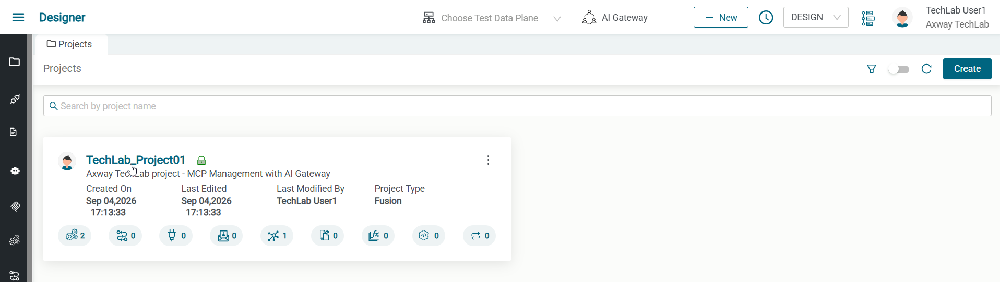
* Ouvrez le serveur MCP existant `Invoice Fusion MCP Server`.
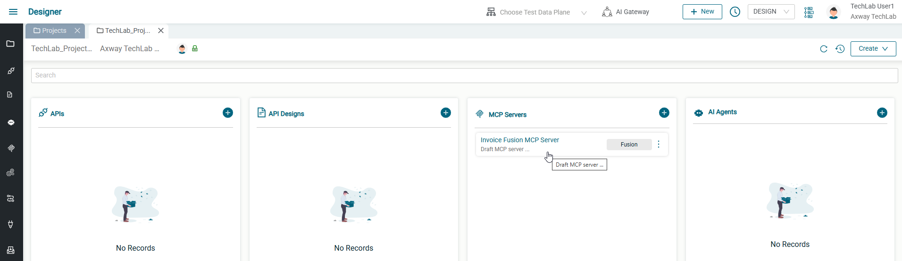
* Modifiez la configuration du serveur MCP et définissez un frontend base path unique (utilisez par exemple votre nom d'utilisateur).
* Cliquez sur **Save**.
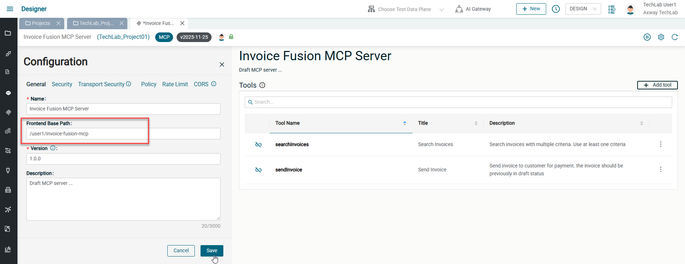

### 2. Ajouter un tool

* Cliquez sur **Add Tool**.
* Donnez-lui le nom `applyDiscount`.
* Donnez-lui le titre `Apply Discount to Invoice`.
* Saisissez une description précise : `Apply a discount to a specified invoice. Discounts can only be applied to draft invoices.`
* Définissez le schéma JSON d'entrée, par exemple :
  ```json
  {
    "type": "object",
    "properties": {
      "discount": {
        "type": "string",
        "example": "10%"
      },
      "invoice_id": {
        "type": "string"
      }
    },
    "required": [ "discount" , "invoice_id" ]
  }
  ```
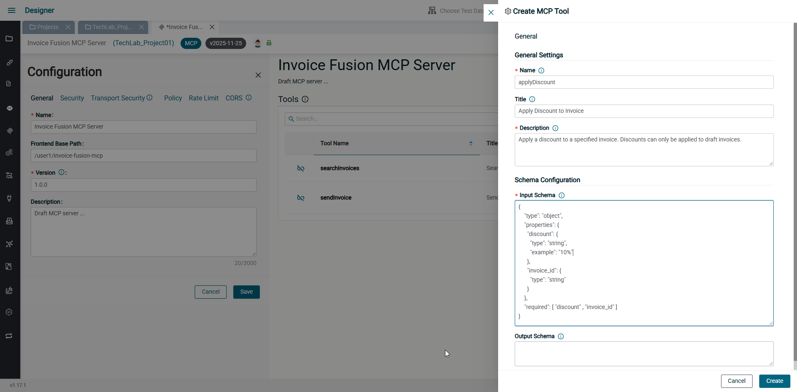

### 3. Ajouter une intégration au tool

* Cliquez sur l'icône de lien pour ajouter une intégration.
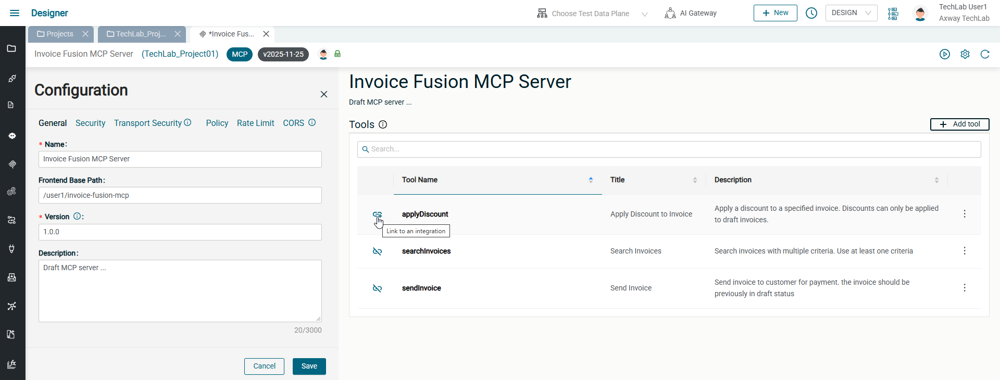
* Choisissez **Create a new integration** et nommez-la `mcpTool_applyDiscount`.
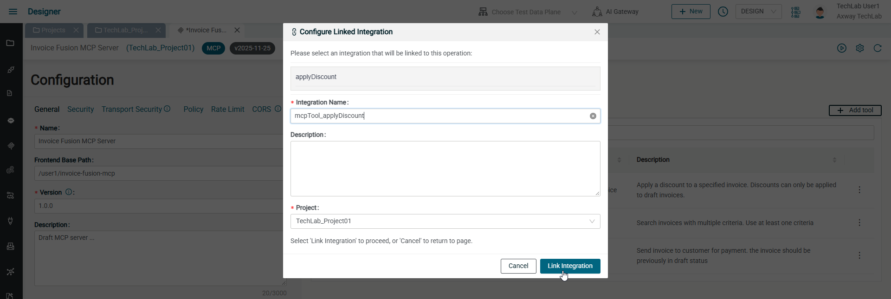
* Agrandir le composant **Tools** dans le flux d'intégration.
* Ajoutez un appel API :
  * Cliquez le bouton **+** et ajoutez un composant de type **OpenAPI client - Invoke operation**
  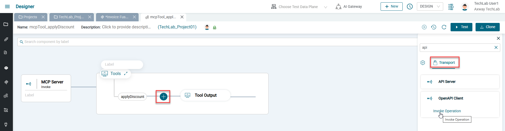
  * Agrandir le panneau inférieur.
  * Sélectionnez la connexion existante **Zoho Invoice API** dans le panneau central.
  * Sélectionnez l'objet **Invoice**.
  * Sélectionnez l'action **UpdateInvoice** (l'opération d'API).
  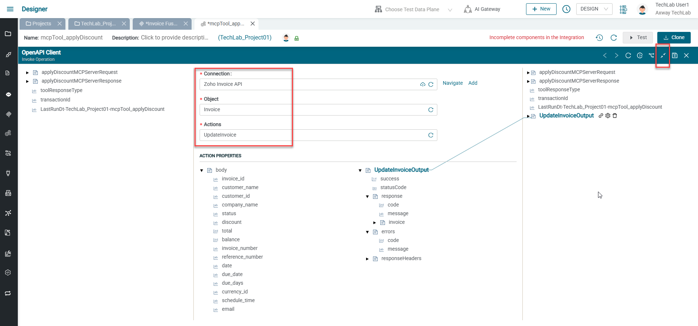
  * Dans l'arborescence des variables d'entrée, à gauche, localisez **applyDiscountMCPServerRequest/body/discount** et **applyDiscountMCPServerRequest/body/invoice_id**.
  * Mappez **applyDiscountMCPServerRequest/body/discount** vers **body/discount** en tirant une ligne de gauche à droite entre ces variables
  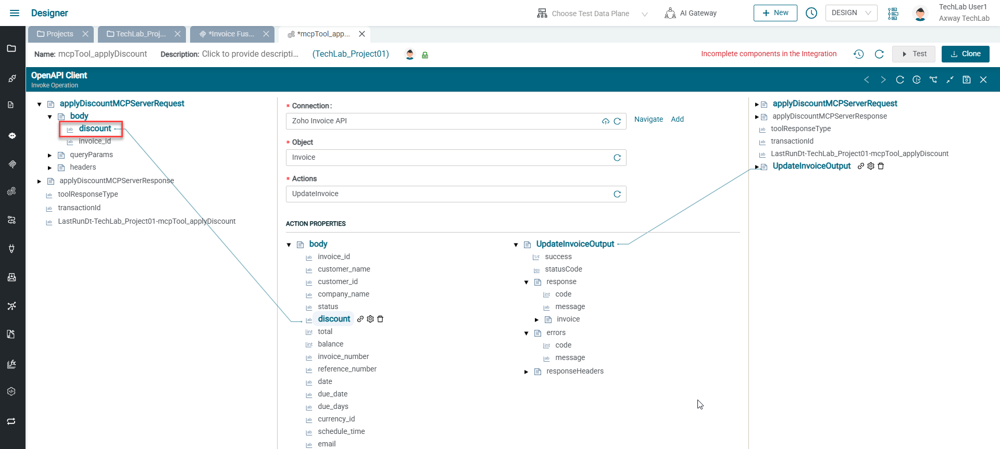
  * Mappez **applyDiscountMCPServerRequest/body/invoice_id** vers **pathParams/Invoice_id** (Attention: ne pas confondre avec **body/invoice_id**).
  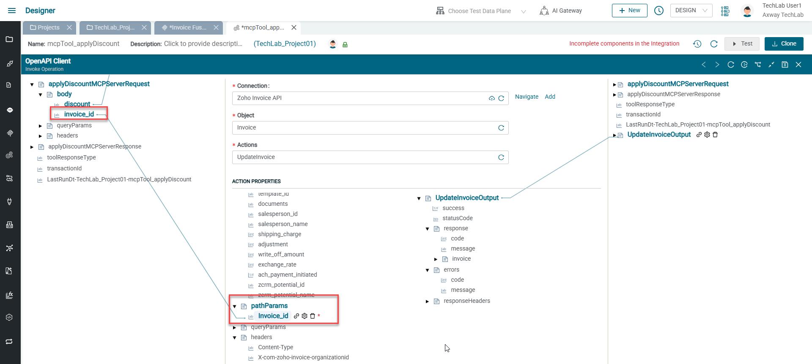
  * Dans l'arborescence des variables de sortie, à droite, localisez **applyDiscountMCPServerResponse/TextContent/result/content/text**.
  * Mappez **UpdateInvoiceOutput/response/message** vers **applyDiscountMCPServerResponse/TextContent/result/content/text** à droite.
  * Mappez **UpdateInvoiceOutput/errors/message** vers le même **applyDiscountMCPServerResponse/TextContent/result/content/text** à droite.
  * Faites un clic droit sur **toolResponseType** à droite et définissez sa valeur (**Set Value**) à `TextContent`.
  * Enregistrez la configuration du composant.
  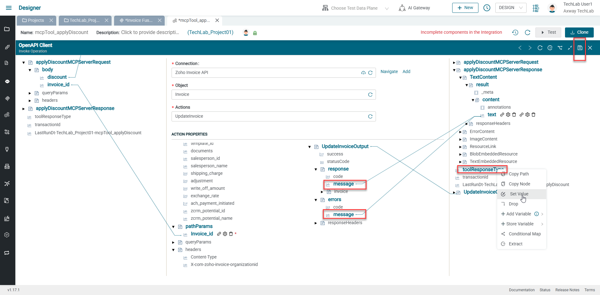

### 4. Vérifier la connection back-end

* Cliquez sur **Navigate** à côté de la connexion API.
* Faites défiler les propriétés de connexion de l'API backend et cliquez sur **Test**.
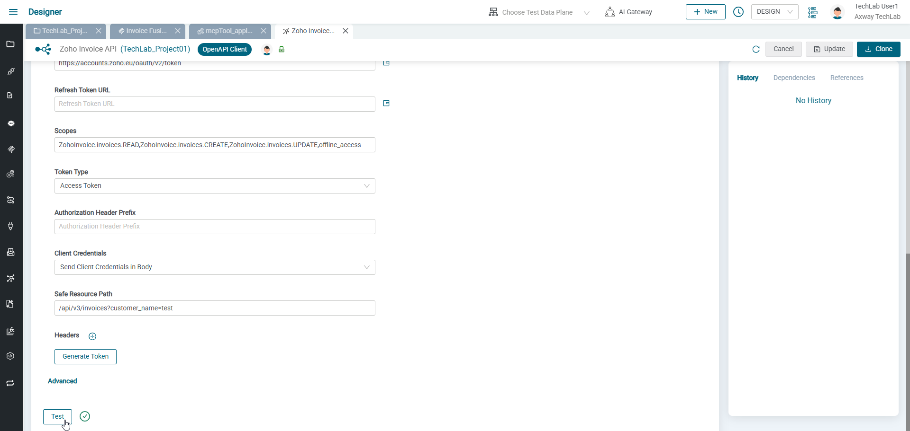
* Si une coche verte s'affiche, continuez avec l'étape 5.
* En cas de croix rouge, essayez **Generate token** juste au-dessus et fournissez les identifiants utilisateur Zoho fournis.
  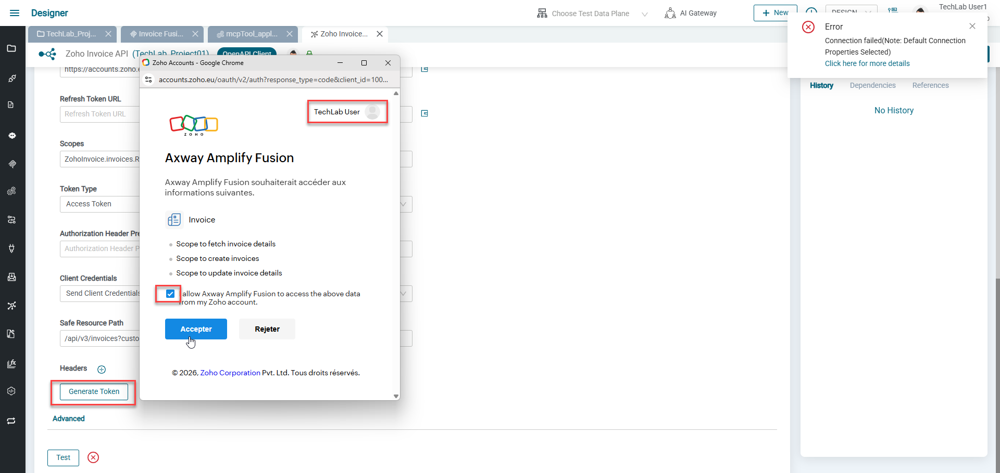
  * Si une coche verte s'affiche, cliquez sur **Test** à nouveau. Si une coche verte s'affiche, continuez avec l'étape 5.
  * Dans les autres cas, vérifiez les détails de connexion et la configuration du côté Zoho Invoice.


### 5. Activer le serveur MCP

* Revenez à votre serveur MCP et activez-le.
* Copiez l'URL du serveur MCP.
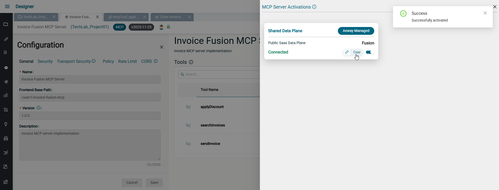

### 6. Tester depuis Claude Desktop

* Ouvrez la configuration de Claude Desktop (File > Settings > Developers > Edit Config).
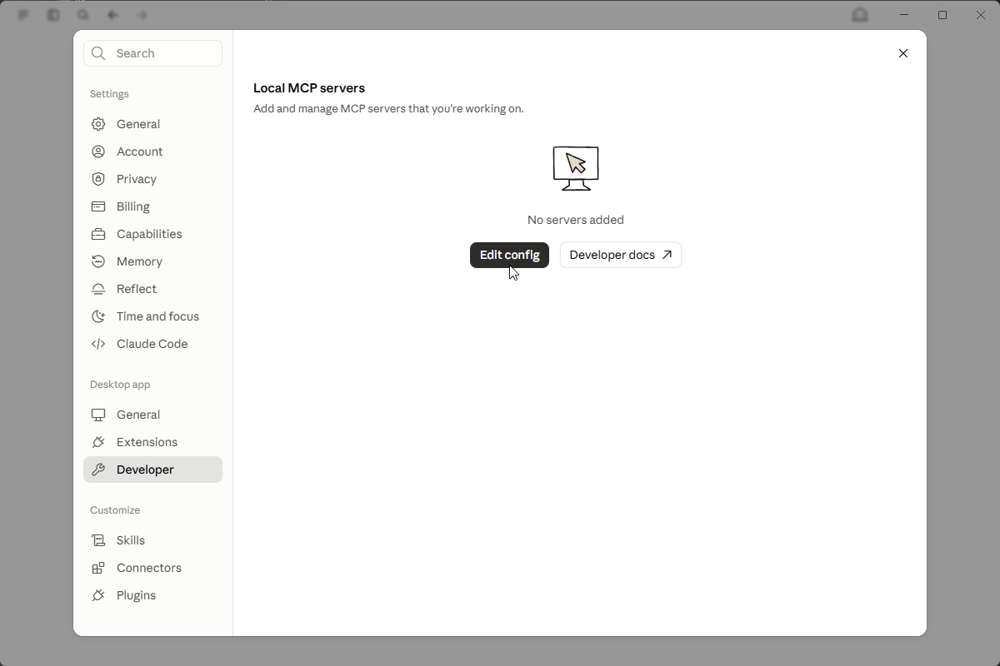
* Ajoutez votre serveur MCP dans `claude_desktop_config.json` :
  ```json
  {
    "mcpServers": {
      "Invoice Fusion MCP Server": {
        "command": "npx",
        "args": ["mcp-remote", "<votre URL de serveur MCP>"]
      }
    }
  }
  ```
* Enregistrez le fichier de configuration.
* Redémarrez Claude Desktop (File > Exit, puis rouvrez l'application).
* Vérifiez que le statut du serveur MCP est `running`.
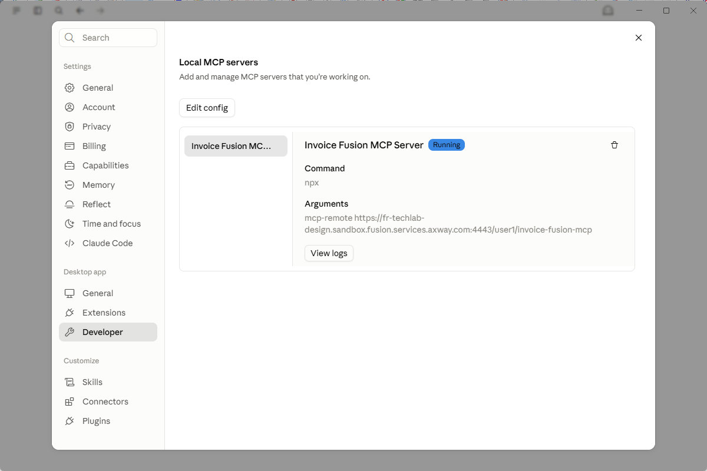
* Démarrez une nouvelle conversation, activez le serveur MCP et testez les prompts suivants :
  * `Quelle est la dernière facture à l'état brouillon?` -> doit fournir les détails de la facture, y compris le total et la date d'échéance.
  * `Appliquer une remise de 10%.` -> doit mettre à jour la facture en conséquence.
  * `L'envoyer.` -> doit marquer la facture comme envoyée.

